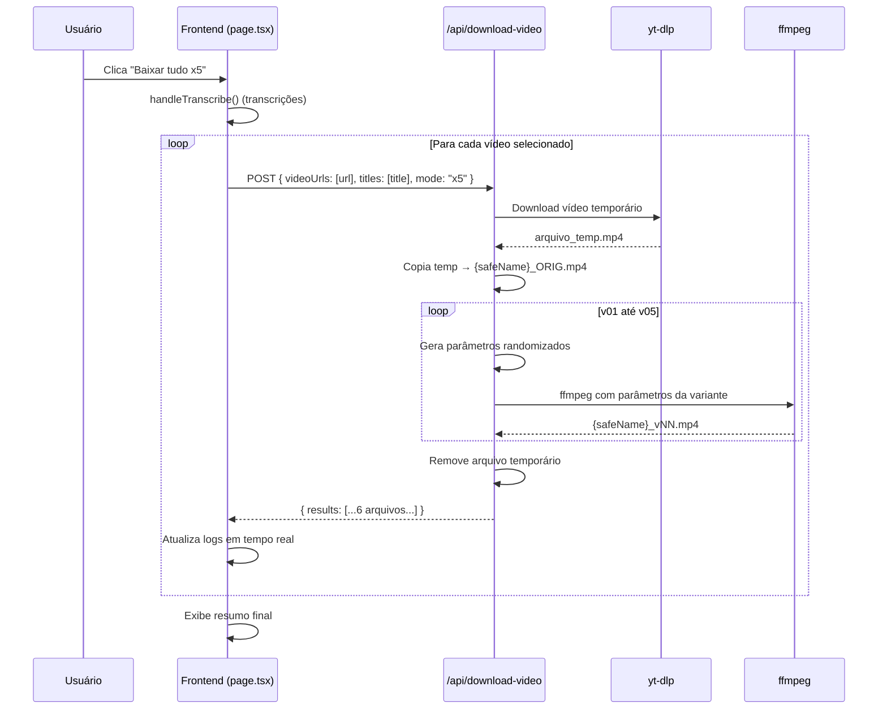

# Documento de Design: Download x5 Variantes

## Visão Geral

Esta funcionalidade estende o sistema existente de download de vídeos do TikTok Scraper para gerar 5 variantes únicas de cada vídeo, além de preservar o original. O objetivo é produzir arquivos com fingerprints de mídia distintos, porém visualmente imperceptíveis, através da randomização de parâmetros ffmpeg.

A abordagem reutiliza o endpoint existente `/api/download-video` adicionando um parâmetro `mode: "x5"`, evitando a criação de novas rotas. O frontend processa um vídeo por requisição de forma sequencial para respeitar limites de timeout.

### Decisões de Design

1. **Extensão do endpoint existente** em vez de criar um novo — mantém a API simples e reutiliza a infraestrutura de download já validada (yt-dlp + ffmpeg).
2. **Processamento sequencial (1 vídeo por request)** — evita timeouts em ambientes com proxy Traefik e VPS com recursos limitados. O `maxDuration` de 300s do endpoint é suficiente para 1 vídeo + 5 variantes.
3. **Randomização independente por variante** — cada variante recebe seu próprio conjunto de parâmetros ffmpeg gerados aleatoriamente, garantindo fingerprints únicos.
4. **Preservação do comportamento existente** — requisições sem `mode: "x5"` continuam funcionando exatamente como antes.

## Arquitetura



### Fluxo de Dados

1. O frontend coleta os vídeos selecionados e inicia o fluxo sequencial
2. Para cada vídeo, uma requisição POST é enviada com `mode: "x5"`
3. O backend baixa o vídeo via yt-dlp, salva o original como `_ORIG.mp4`
4. O backend gera 5 variantes com parâmetros ffmpeg randomizados
5. O backend retorna a lista de todos os arquivos gerados (ou erros parciais)
6. O frontend atualiza os logs e continua para o próximo vídeo

## Componentes e Interfaces

### Frontend — `app/page.tsx`

Novos estados adicionados ao componente `Home`:

```typescript
const [isDownloadingX5, setIsDownloadingX5] = useState(false);
const [downloadX5Status, setDownloadX5Status] = useState<string | null>(null);
```

Nova função `handleDownloadX5`:
- Valida que há vídeos selecionados
- Executa `handleTranscribe()` primeiro (mesmo padrão do `handleDownloadAll`)
- Itera sequencialmente sobre `selectedVideoUrls`
- Para cada vídeo, envia POST para `/api/download-video` com `{ videoUrls: [url], titles: [title], mode: "x5" }`
- Atualiza `detailLogs` após cada requisição
- Ao final, exibe resumo com contagem de sucessos/falhas

### Frontend — `app/globals.css`

Nova classe CSS:

```css
.btn-download-x5 {
  background: linear-gradient(135deg, #e17055, #fdcb6e);
  color: #fff;
  padding: 0.75rem 1.5rem;
  font-size: 1rem;
}

.btn-download-x5:hover:not(:disabled) {
  transform: translateY(-1px);
  box-shadow: 0 4px 15px rgba(225, 112, 85, 0.4);
}
```

Gradiente laranja/dourado para diferenciar visualmente do botão "Baixar tudo" (roxo) e "Baixar vídeos" (verde).

### Backend — `app/api/download-video/route.ts`

Extensão do handler POST existente:

```typescript
// Novo parâmetro extraído do body
const { videoUrls, titles, mode } = await req.json();

// Função de geração de parâmetros randomizados
function generateRandomParams(): {
  crf: number;
  scaleFactor: number;
  noise: number;
  speed: number;
  pitch: number;
} {
  return {
    crf: Math.floor(Math.random() * 7) + 20,           // 20-26
    scaleFactor: 1.005 + Math.random() * 0.015,         // 1.005-1.02
    noise: Math.floor(Math.random() * 4) + 2,           // 2-5
    speed: 0.98 + Math.random() * 0.04,                 // 0.98-1.02
    pitch: 0.99 + Math.random() * 0.03,                 // 0.99-1.02
  };
}
```

Lógica condicional no loop de processamento:
- Se `mode === "x5"`: salva original sem ffmpeg (`_ORIG.mp4`), depois gera 5 variantes
- Se `mode` ausente ou diferente: comportamento atual inalterado

### Interface de Resposta (modo x5)

```typescript
// Cada item no array results
type DownloadResult = {
  url: string;
  status: "ok" | "failed";
  filename?: string;   // nome do arquivo gerado
  error?: string;      // mensagem de erro se falhou
  variant?: string;    // "ORIG" | "v01" | "v02" | ... | "v05"
};

// Resposta completa
type DownloadX5Response = {
  message: string;
  downloadDir: string;
  results: DownloadResult[];
};
```

## Modelos de Dados

### Parâmetros Randomizados (por variante)

| Parâmetro    | Tipo   | Faixa           | Uso no ffmpeg                          |
|-------------|--------|-----------------|----------------------------------------|
| crf         | number | 20–26 (inteiro) | `-crf {valor}`                         |
| scaleFactor | number | 1.005–1.02      | `scale=iw*{f}:ih*{f},crop=iw/{f}:ih/{f}` |
| noise       | number | 2–5 (inteiro)   | `noise=alls={valor}:allf=t`            |
| speed       | number | 0.98–1.02       | `setpts={1/speed}*PTS` + `atempo={speed}` |
| pitch       | number | 0.99–1.02       | `asetrate=44100*{valor},aresample=44100` |

### Convenção de Nomenclatura

| Tipo      | Padrão de Nome            | Exemplo                        |
|-----------|--------------------------|--------------------------------|
| Original  | `{safeName}_ORIG.mp4`    | `meu_video_ORIG.mp4`          |
| Variante  | `{safeName}_v{NN}.mp4`   | `meu_video_v01.mp4`           |
| Transcrição | `{safeName}.txt`       | `meu_video.txt`                |

### Estados do Frontend

| Estado             | Tipo            | Descrição                                      |
|-------------------|-----------------|-------------------------------------------------|
| isDownloadingX5   | boolean         | Indica se o fluxo x5 está em andamento          |
| downloadX5Status  | string \| null  | Mensagem de status/resumo do download x5         |


## Propriedades de Corretude

*Uma propriedade é uma característica ou comportamento que deve ser verdadeiro em todas as execuções válidas de um sistema — essencialmente, uma declaração formal sobre o que o sistema deve fazer. Propriedades servem como ponte entre especificações legíveis por humanos e garantias de corretude verificáveis por máquina.*

### Propriedade 1: Faixas de parâmetros randomizados

*Para qualquer* conjunto de parâmetros gerado pela função `generateRandomParams`, os valores devem estar dentro das faixas especificadas: CRF entre 20 e 26 (inteiro), scaleFactor entre 1.005 e 1.02, noise entre 2 e 5 (inteiro), speed entre 0.98 e 1.02, e pitch entre 0.99 e 1.02.

**Valida: Requisitos 4.1, 4.2, 4.3, 4.4, 4.5**

### Propriedade 2: Independência dos parâmetros entre variantes

*Para qualquer* lote de 5 conjuntos de parâmetros gerados para um vídeo, nem todos os 5 conjuntos devem ser idênticos entre si (ao menos um par de conjuntos deve diferir em pelo menos um parâmetro).

**Valida: Requisito 4.6**

### Propriedade 3: Convenção de nomenclatura de arquivos x5

*Para qualquer* título de vídeo processado no modo x5, os nomes dos arquivos gerados devem seguir a convenção: `{sanitizeFilename(titulo)}_ORIG.mp4` para o original e `{sanitizeFilename(titulo)}_v{NN}.mp4` (NN de 01 a 05) para as variantes, totalizando exatamente 6 arquivos.

**Valida: Requisitos 5.1, 5.2, 3.1, 3.2, 7.1**

### Propriedade 4: Compatibilidade retroativa do endpoint

*Para qualquer* requisição ao endpoint `/api/download-video` sem o parâmetro `mode` ou com `mode` diferente de `"x5"`, o comportamento de processamento deve ser idêntico ao fluxo atual (download + ffmpeg único + resultado único por vídeo).

**Valida: Requisito 3.3**

### Propriedade 5: Requisições sequenciais com corpo correto

*Para qualquer* lista de N vídeos selecionados no fluxo x5, o frontend deve enviar exatamente N requisições POST sequenciais, cada uma com `mode: "x5"` e `videoUrls` contendo exatamente 1 URL.

**Valida: Requisitos 2.2, 2.3**

### Propriedade 6: Desabilitação de botões durante download x5

*Para qualquer* estado do frontend onde `isDownloadingX5` é `true`, o botão "Baixar tudo x5" deve estar desabilitado com texto "Baixando x5...", e os botões "Baixar tudo", "Baixar Transcrição" e "Baixar vídeos selecionados" também devem estar desabilitados.

**Valida: Requisitos 1.3, 1.4**

### Propriedade 7: Resiliência a falhas parciais no frontend

*Para qualquer* sequência de N vídeos onde o vídeo na posição K falha (1 ≤ K ≤ N), o frontend deve continuar processando os vídeos restantes (K+1 até N) e o log deve conter uma entrada de erro para o vídeo K.

**Valida: Requisito 6.3**

### Propriedade 8: Resiliência a falhas parciais no backend

*Para qualquer* requisição x5 onde a variante na posição J falha (1 ≤ J ≤ 5), o backend deve incluir o erro no campo `results` para aquela variante e continuar gerando as variantes restantes.

**Valida: Requisito 7.2**

### Propriedade 9: Resumo final com contagens corretas

*Para qualquer* lista de resultados de download x5 contendo S sucessos e F falhas, o resumo final exibido pelo frontend deve reportar exatamente S sucessos e F falhas, onde S + F = total de vídeos processados.

**Valida: Requisito 6.4**

### Propriedade 10: Limpeza de arquivo temporário

*Para qualquer* vídeo processado no modo x5, o arquivo temporário do yt-dlp não deve existir no diretório de downloads após a conclusão do processamento (independente de sucesso ou falha nas variantes).

**Valida: Requisito 3.4**

## Tratamento de Erros

### Erros no Backend

| Cenário | Comportamento | Resposta |
|---------|--------------|----------|
| URL inválida / yt-dlp falha | Retorna erro para aquele vídeo no `results` | `{ status: "failed", error: "..." }` |
| ffmpeg falha em uma variante | Registra erro para aquela variante, continua com as demais | Variante com `status: "failed"` no array |
| Cópia do original falha | Retorna erro, não tenta gerar variantes | `{ status: "failed", error: "..." }` para ORIG |
| Disco cheio / permissão negada | Erro capturado no try/catch, retornado no results | `{ status: "failed", error: "..." }` |
| Timeout do ffmpeg (300s) | `execAsync` rejeita com timeout error | Capturado e reportado como falha |

### Erros no Frontend

| Cenário | Comportamento |
|---------|--------------|
| Requisição de rede falha | Log de erro adicionado, continua para próximo vídeo |
| Resposta HTTP não-ok | Extrai mensagem de erro, adiciona ao log |
| Todos os vídeos falham | Resumo final mostra 0 sucessos e N falhas |
| Transcrição falha antes do download | Download x5 continua normalmente (mesmo padrão do handleDownloadAll) |

### Limpeza de Recursos

- O arquivo temporário do yt-dlp é removido no bloco `finally` ou após o loop de variantes
- Se o processo for interrompido, arquivos parciais podem permanecer no diretório `downloads/`
- Não há mecanismo de rollback — arquivos já gerados permanecem mesmo se variantes posteriores falharem

## Estratégia de Testes

### Abordagem Dual

A estratégia combina testes unitários (exemplos específicos) com testes baseados em propriedades (validação universal):

- **Testes unitários**: Verificam exemplos concretos, edge cases e condições de erro
- **Testes de propriedade**: Verificam propriedades universais com inputs gerados aleatoriamente
- Ambos são complementares e necessários para cobertura abrangente

### Biblioteca de Testes

- **Framework**: Vitest (compatível com o ecossistema Next.js)
- **Property-Based Testing**: `fast-check` (biblioteca PBT para TypeScript/JavaScript)
- **Configuração**: Mínimo de 100 iterações por teste de propriedade

### Testes de Propriedade

Cada propriedade de corretude deve ser implementada por um único teste baseado em propriedade:

- **Feature: download-x5-variants, Property 1: Faixas de parâmetros randomizados** — Gerar N conjuntos de parâmetros e verificar que todos os valores estão nas faixas
- **Feature: download-x5-variants, Property 2: Independência dos parâmetros entre variantes** — Gerar lotes de 5 conjuntos e verificar que não são todos idênticos
- **Feature: download-x5-variants, Property 3: Convenção de nomenclatura de arquivos x5** — Gerar títulos aleatórios e verificar que os nomes de arquivo seguem o padrão
- **Feature: download-x5-variants, Property 4: Compatibilidade retroativa do endpoint** — Verificar que requisições sem mode="x5" produzem resultado com estrutura do fluxo atual
- **Feature: download-x5-variants, Property 5: Requisições sequenciais com corpo correto** — Gerar listas de URLs e verificar que cada request tem mode="x5" e 1 URL
- **Feature: download-x5-variants, Property 6: Desabilitação de botões durante download x5** — Gerar estados com isDownloadingX5=true e verificar botões desabilitados
- **Feature: download-x5-variants, Property 7: Resiliência a falhas parciais no frontend** — Gerar sequências com falhas em posições aleatórias e verificar continuidade
- **Feature: download-x5-variants, Property 8: Resiliência a falhas parciais no backend** — Gerar cenários com variantes falhando e verificar que as demais são geradas
- **Feature: download-x5-variants, Property 9: Resumo final com contagens corretas** — Gerar listas de resultados mistos e verificar contagens no resumo
- **Feature: download-x5-variants, Property 10: Limpeza de arquivo temporário** — Verificar que temp files são removidos após processamento

### Testes Unitários

Focar em:
- Renderização do botão "Baixar tudo x5" na posição correta (exemplo)
- Spinner visível durante loading (exemplo)
- Classe CSS `btn-download-x5` aplicada ao botão (exemplo)
- Botão desabilitado quando nenhum vídeo selecionado (exemplo)
- Chamada de `handleTranscribe` antes do loop de downloads (exemplo)
- Resposta do endpoint com `downloadDir` presente (exemplo)

### Configuração de Cada Teste de Propriedade

```typescript
// Exemplo de tag para rastreabilidade
// Feature: download-x5-variants, Property 1: Faixas de parâmetros randomizados
it("should generate parameters within specified ranges", () => {
  fc.assert(
    fc.property(fc.nat(), () => {
      const params = generateRandomParams();
      expect(params.crf).toBeGreaterThanOrEqual(20);
      expect(params.crf).toBeLessThanOrEqual(26);
      // ... demais verificações
    }),
    { numRuns: 100 }
  );
});
```
