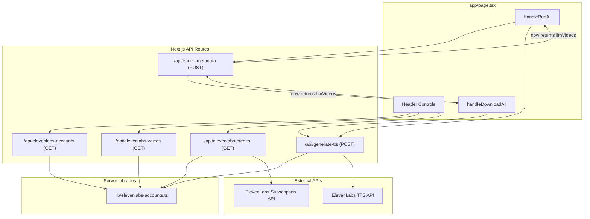

# Design Document: ElevenLabs TTS Integration

## Overview

This feature integrates ElevenLabs Text-to-Speech (TTS) into the existing TikTok Scraper pipeline. After the OpenAI enrich step produces `LLM_Transcription` content, the system automatically generates MP3 audio files via ElevenLabs TTS. The integration replicates the existing dynamic multi-account pattern used for Apify, adds voice selection and ElevenLabs credits display to the header UI, and triggers TTS generation in both the "Run AI" and "Download All" flows.

The pipeline order becomes: Transcribe → Enrich (OpenAI) → TTS (ElevenLabs) → Download Videos.

## Architecture



### Key Design Decisions

1. **Replicate multi-account pattern**: `lib/elevenlabs-accounts.ts` mirrors `lib/apify-accounts.ts` exactly — parse JSON env var, export typed getters, fallback gracefully.
2. **Separate voices from accounts**: `ELEVENLABS_VOICES` is a distinct env var so voices can be configured independently of accounts.
3. **Sequential TTS calls**: Use a `for` loop (not `Promise.all`) to respect ElevenLabs rate limits, matching the existing sequential pattern used for video downloads.
4. **Additive enrich-metadata change**: The existing endpoint adds `llmVideos` to its response — no breaking changes to existing fields.
5. **Fail-fast in Download All**: If the enrich step fails (HTTP error), the entire Download All flow stops immediately. This is a behavior change from the current resilient approach, as specified in requirements.
6. **Replicated `sanitizeFilename()`**: Maintain the existing pattern of each route having its own copy rather than centralizing.

## Components and Interfaces

### 1. `lib/elevenlabs-accounts.ts` — Server Library

```typescript
export interface ElevenLabsAccount {
  id: string;
  label: string;
  token: string;
  default: boolean;
}

export interface ElevenLabsVoice {
  id: string;
  name: string;
  default: boolean;
}

// Parse ELEVENLABS_ACCOUNTS env var, return [] on missing/invalid
export function getElevenLabsAccounts(): ElevenLabsAccount[];

// Resolve token: specific accountId → default account → first account → ""
export function getTokenForElevenLabsAccount(accountId?: string): string;

// Parse ELEVENLABS_VOICES env var, return [] on missing/invalid
export function getElevenLabsVoices(): ElevenLabsVoice[];
```

### 2. `app/api/elevenlabs-accounts/route.ts` — GET

Returns `{ accounts: [{id, label, default}] }`. Excludes `token` field.

### 3. `app/api/elevenlabs-voices/route.ts` — GET

Returns `{ voices: [{id, name, default}] }` from the library.

### 4. `app/api/elevenlabs-credits/route.ts` — GET

Query param: `?accountId=el_1` (optional).

Calls `GET https://api.elevenlabs.io/v1/user/subscription` with `xi-api-key` header.

Returns `{ characterCount, characterLimit, characterRemaining }`.

### 5. `app/api/generate-tts/route.ts` — POST

Request body:
```typescript
{ text: string; title: string; accountId?: string; voiceId: string }
```

Calls `POST https://api.elevenlabs.io/v1/text-to-speech/{voiceId}` with `xi-api-key` header and `{ text, model_id: "eleven_multilingual_v2" }` body.

`maxDuration = 120` to allow generous time for longer transcriptions.

Saves response audio as `{sanitizeFilename(title)}.mp3` in `downloads/`.

Each TTS call is isolated per video item with its own try/catch, ensuring a failure on one item does not affect others or cause timeouts on the overall flow.

Returns `{ status: "ok", filename: string }` on success, or `{ error: string }` with status 500 on failure.

### 6. `app/api/enrich-metadata/route.ts` — Modified POST

Additive change: include `llmVideos: llmResult.videos` in the successful JSON response alongside existing `savedFiles`, `errors`, `debugLogs`, `downloadDir`.

### 7. `app/page.tsx` — Frontend Changes

New state variables:
- `elevenlabsAccounts`, `selectedElevenLabsAccountId`
- `elevenlabsVoices`, `selectedVoiceId`
- `elevenlabsCredits` (characterRemaining)

New `useEffect` on mount: fetch `/api/elevenlabs-accounts` and `/api/elevenlabs-voices`, set defaults.

New `fetchElevenLabsCredits(accountId?)` callback.

Modified `handleRunAI`:
- After successful enrich call, read `data.llmVideos`
- If enrich HTTP fails → stop entirely (existing behavior preserved)
- Loop over `llmVideos` sequentially, skip items where `transcription.startsWith("ERRO:")`, call `/api/generate-tts` for each
- Update status: "Generating TTS 2 of 5..."

Modified `handleDownloadAll`:
- After enrich call, if `!enrichRes.ok` → stop entire flow (fail-fast change)
- Read `enrichData.llmVideos`, loop sequentially, skip "ERRO:" items, call `/api/generate-tts`
- Then proceed to video downloads

Header controls reordered: Settings → Voice ID → TTS API → ElevenLabs Credits → Transcription API → Apify Credits.

Transcription API dropdown visibility condition preserved (`apifyAccounts.length > 1`) — no change to existing Apify dropdown behavior.

## Data Models

### Environment Variables

```
ELEVENLABS_ACCOUNTS=[{"id":"el_1","label":"user@example.com","token":"sk_xxx","default":true}]
ELEVENLABS_VOICES=[{"id":"voiceId123","name":"Voice 1","default":true}]
```

### ElevenLabs TTS API Request

```
POST https://api.elevenlabs.io/v1/text-to-speech/{voice_id}
Headers: { "xi-api-key": "<token>", "Content-Type": "application/json" }
Body: { "text": "<LLM_Transcription>", "model_id": "eleven_multilingual_v2" }
Response: audio/mpeg binary stream
```

### ElevenLabs Subscription API Response

```
GET https://api.elevenlabs.io/v1/user/subscription
Headers: { "xi-api-key": "<token>" }
Response: {
  "character_count": number,
  "character_limit": number,
  ...
}
```

### Generate TTS Endpoint

Request: `{ text: string, title: string, accountId?: string, voiceId: string }`
Success response: `{ status: "ok", filename: "Sanitized_Name.mp3" }`
Error response: `{ error: "message" }` (status 500)

### Enrich Metadata Endpoint (Modified Response)

```typescript
{
  savedFiles: string[];
  errors: string[];
  debugLogs: string[];
  downloadDir: string;
  llmVideos: Array<{       // NEW field
    videoId: string;
    title: string;
    description: string;
    hashtags: string;
    transcription: string;
  }>;
}
```

### File Naming Convention

All output files for a given video share the same sanitized base name:
- `{Sanitized_Filename}.txt` — enriched metadata
- `{Sanitized_Filename}.mp3` — TTS audio (NEW)
- `{Sanitized_Filename}.mp4` — downloaded video


## Correctness Properties

*A property is a characteristic or behavior that should hold true across all valid executions of a system — essentially, a formal statement about what the system should do. Properties serve as the bridge between human-readable specifications and machine-verifiable correctness guarantees.*

### Property 1: Env var parsing round trip

*For any* valid JSON array of account objects (with id, label, token, default fields) set as the `ELEVENLABS_ACCOUNTS` env var, `getElevenLabsAccounts()` should return an array with the same length and identical field values. The same holds for `ELEVENLABS_VOICES` and `getElevenLabsVoices()`.

**Validates: Requirements 1.1, 1.3**

### Property 2: Token resolution fallback chain

*For any* list of ElevenLabs accounts and any optional accountId, `getTokenForElevenLabsAccount(accountId)` should return: (a) the token of the account matching accountId if it exists, (b) otherwise the token of the account marked `default: true`, (c) otherwise the token of the first account, (d) otherwise an empty string.

**Validates: Requirements 1.2**

### Property 3: Accounts endpoint excludes tokens

*For any* set of ElevenLabs accounts returned by the accounts API endpoint, every item in the response should contain `id`, `label`, and `default` fields, and no item should contain a `token` field.

**Validates: Requirements 2.1, 2.2**

### Property 4: Credits endpoint maps subscription fields

*For any* ElevenLabs subscription API response containing `character_count` and `character_limit`, the credits endpoint should return `characterCount` equal to `character_count`, `characterLimit` equal to `character_limit`, and `characterRemaining` equal to `character_limit - character_count`.

**Validates: Requirements 4.1**

### Property 5: TTS filename consistency

*For any* title string, the generate-tts endpoint should save the MP3 file with a filename equal to `sanitizeFilename(title) + ".mp3"`, using the same sanitization logic as the .txt and .mp4 files.

**Validates: Requirements 5.2, 13.3**

### Property 6: TTS iteration skips ERRO-prefixed transcriptions

*For any* array of llmVideos where some items have a `transcription` field starting with `"ERRO:"`, the TTS generation loop should call the generate-tts endpoint only for items whose transcription does NOT start with `"ERRO:"`, and should add a log entry for each skipped item.

**Validates: Requirements 7.3, 8.3**

### Property 7: Enrich response preserves existing fields and adds llmVideos

*For any* successful enrich-metadata response, the JSON should contain the existing fields (`savedFiles`, `errors`, `debugLogs`, `downloadDir`) unchanged, plus a new `llmVideos` array containing the LLM-processed video objects.

**Validates: Requirements 6.1, 13.2**

## Error Handling

| Scenario | Behavior |
|---|---|
| `ELEVENLABS_ACCOUNTS` missing or invalid JSON | `getElevenLabsAccounts()` returns `[]`, no error thrown |
| `ELEVENLABS_VOICES` missing or invalid JSON | `getElevenLabsVoices()` returns `[]`, no error thrown |
| No ElevenLabs accounts configured | Token resolves to `""`, TTS API calls will fail with auth error, surfaced to user via logs |
| ElevenLabs subscription API fails | `/api/elevenlabs-credits` returns `{ error: "..." }` with status 500 |
| ElevenLabs TTS API fails | `/api/generate-tts` returns `{ error: "..." }` with status 500; frontend logs the error and continues to next video |
| Enrich step fails (HTTP error) in Run AI | Flow stops entirely — no TTS generation, error displayed to user |
| Enrich step fails (HTTP error) in Download All | Flow stops entirely — no TTS, no video downloads, error displayed to user (fail-fast) |
| LLM_Transcription starts with "ERRO:" | TTS generation skipped for that item, log entry added, loop continues |
| Downloads folder doesn't exist | Created automatically by `generate-tts` before saving |
| Individual TTS call fails mid-loop | Error logged, loop continues to next video |

## Testing Strategy

### Unit Tests

Focus on specific examples and edge cases:
- `getElevenLabsAccounts()` with missing env var returns `[]`
- `getElevenLabsAccounts()` with invalid JSON returns `[]`
- `getTokenForElevenLabsAccount()` with no accounts returns `""`
- `sanitizeFilename()` produces consistent output across routes for known inputs
- Enrich-metadata response includes `llmVideos` field (mock OpenAI)
- Generate-tts creates `downloads/` directory if missing
- Credits endpoint returns 500 when ElevenLabs API is unreachable

### Property-Based Tests

Use `fast-check` as the property-based testing library (already compatible with the Next.js/TypeScript stack).

Each property test should run a minimum of 100 iterations and be tagged with a comment referencing the design property.

Tag format: **Feature: elevenlabs-tts-integration, Property {number}: {property_text}**

- **Property 1 test**: Generate random arrays of `{id, label, token, default}` objects, serialize to JSON, set as env var, call `getElevenLabsAccounts()`, verify output matches input. Same for voices.
- **Property 2 test**: Generate random account lists and optional accountId strings, call `getTokenForElevenLabsAccount()`, verify the returned token follows the fallback chain (specific → default → first → "").
- **Property 3 test**: Generate random account arrays, call the accounts endpoint handler, verify every response item has `id`/`label`/`default` and no `token`.
- **Property 4 test**: Generate random `character_count` and `character_limit` numbers, mock the ElevenLabs subscription response, call the credits endpoint, verify the mapping and arithmetic.
- **Property 5 test**: Generate random title strings, call `sanitizeFilename()`, verify the output matches the expected regex pattern and the MP3 filename is `sanitizeFilename(title) + ".mp3"`.
- **Property 6 test**: Generate random arrays of llmVideo objects where transcription is randomly prefixed with "ERRO:" or not, run the TTS iteration logic, verify only non-ERRO items trigger TTS calls.
- **Property 7 test**: Mock a successful enrich-metadata call, verify the response contains both existing fields and the new `llmVideos` field.
